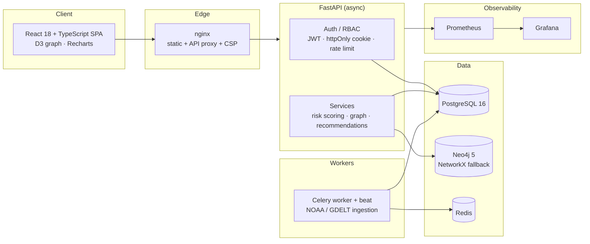

<div align="center">

# 🛡️ SupplyShield AI

### Enterprise Supply Chain Dependency & Risk Intelligence Platform

*See your entire multi-tier supply chain. Score every supplier's risk — explainably. Simulate disruptions before they cascade.*


</div>

---

## The problem

A single Tier‑3 supplier failure — a flood, an export ban, a bankruptcy — can silently halt a
production line two tiers downstream. Most teams discover these dependencies *after* the disruption,
because the data lives in spreadsheets and the risk lives in people's heads.

**SupplyShield AI turns that blind spot into a live, explainable map** — so procurement, risk, and
operations teams can see every dependency, quantify every supplier's risk, and stress‑test the
network *before* something breaks.

---

## ✨ What makes it stand out

- **🔍 Explainable risk scoring, not a black box.** Every score breaks down into climate, geopolitical,
  operational, logistics, and dependency components — each with the contributing factors, weights, and
  the real data source behind it. No invented numbers.
- **🕸️ Interactive multi-tier graph.** A D3 force-directed view of suppliers, tiers, and material flows
  — drag, zoom, and click any node to inspect it.
- **💥 Disruption simulator.** Take a supplier offline and watch the cascading downstream impact and
  sole-source vulnerabilities surface instantly.
- **🔁 Explainable alternative-supplier recommendations.** Ranked replacement candidates by geography,
  industry, tier, status, and risk — every recommendation comes with its reasoning.
- **🔐 Production-grade security.** JWT auth with **httpOnly refresh-token cookies**, RBAC across four
  roles, rate-limited login, strict multi-tenant isolation, CSP + security headers, and an audit trail.
- **🧪 Tested for real.** 49 tests that drive the actual app, services, and ORM — not mocked re-implementations.

---

## 🚀 Try it in 60 seconds

```bash
git clone https://github.com/your-org/supplychield.git
cd supplychield
cp .env.example .env          # set SECRET_KEY, POSTGRES_PASSWORD, NEO4J_PASSWORD
docker compose up -d --build
docker compose exec backend alembic upgrade head
docker compose exec backend python scripts/seed_demo.py
```

Open **http://localhost:3000** and click **“Explore with a demo account”** — or log in directly:

<div align="center">

| 🔑 Demo login | |
|---|---|
| **Email** | `demo@gmail.com` |
| **Password** | `demo@1234` |

</div>

The seed builds a realistic 4‑tier automotive supply chain — **14 suppliers, material flows, a flagged
sole‑source lithium dependency, pre‑computed explainable risk scores, and live alerts** — so every screen
has meaningful data on first login. Three additional role-scoped logins demonstrate RBAC.

> No Docker? The backend runs natively on SQLite for zero-setup local demos — see [docs/DEPLOYMENT.md](docs/DEPLOYMENT.md).

---

## 🧩 Core capabilities

| Capability | Description |
|-----------|-------------|
| **Supply Chain Graph** | Interactive D3 visualization of supplier tiers, materials, and relationships |
| **Explainable Risk Scoring** | Composite scores across 5 dimensions, each with contributing factors, weights & sources |
| **Disruption Simulator** | Model cascading impact and sole-source exposure when a supplier goes offline |
| **Alternative Suppliers** | Explainable ranked replacement candidates with full reasoning |
| **Early-Warning Alerts** | Full lifecycle (create → assign → investigate → resolve → close) with Slack/email dispatch |
| **External Intelligence** | Ingestion of NOAA weather & GDELT geopolitical risk events |
| **RBAC** | Admin · Risk Analyst · Procurement Manager · Executive Viewer |
| **Audit Trail** | Every write action logged with user, timestamp, and detail |

---

## 🏗️ Architecture



| Layer | Technology |
|-------|-----------|
| Backend API | FastAPI 0.111, Python 3.12 (async SQLAlchemy 2.0) |
| Primary DB | PostgreSQL 16 |
| Graph | Neo4j 5 with NetworkX fallback |
| Jobs | Celery + Redis |
| Frontend | React 18, TypeScript, Vite, D3.js v7, Recharts |
| Auth | JWT (python-jose) + httpOnly refresh cookies |
| Containers | Docker + Docker Compose |
| CI/CD | GitHub Actions → (optional) AWS ECS |
| Monitoring | Prometheus + Grafana |

---

## 🛠️ Engineering quality

This isn't a prototype with stub data — the engineering choices are deliberate:

- **Explainability by design.** The risk engine returns the factors, weights, and sources behind every
  score; the recommendation engine's scoring is a **pure, dependency-free function** that the production
  path and the tests share — so coverage means something.
- **Real test suite (49).** Backend tests drive the live FastAPI app against a real database (auth flows,
  the access-vs-refresh-token bypass guard, multi-tenant isolation, RBAC, alert lifecycle, risk &
  recommendation engines); frontend tests cover the auth store and components.
- **Async end to end.** Async SQLAlchemy + asyncpg; blocking work (Neo4j, SMTP) is offloaded off the event loop.
- **Secure defaults.** httpOnly/SameSite refresh cookies, login rate limiting, CSP + security headers,
  host allow-listing, and config that **fails fast** on weak production secrets.
- **Portable & observable.** Dialect-portable column types let the suite run on SQLite while production
  uses native `UUID`/`JSONB`; Prometheus metrics and structured request logging are built in.

```bash
cd backend  && PYTHONPATH=. pytest tests/ -v     # 43 passed
cd frontend && npm run test                       # 6 passed
```

---

## 📐 Design principles

1. **No fake data** — every value comes from real APIs, stored records, or clearly labeled simulations.
   Where no risk events are present, the factor is explicitly labeled rather than invented.
2. **Explainable scores** — every risk score ships with its contributing factors, weights, and data sources.
3. **Audit on writes** — write actions are recorded with user, timestamp, and detail.
4. **Soft deletes** — data is never permanently destroyed.
5. **Multi-tenant** — operational data is scoped to `organization_id`; external risk events are a shared feed matched by geography.

---

## 🗺️ Roadmap

The platform is fully functional and demo-ready today. Next on the path to serving production traffic:

- **Automated alerting** — a scheduled threshold/trend evaluator that auto-creates alerts from risk
  scores (alerts are created via API + dispatched to Slack/email today).
- **OpenWeather ingestion** — currently a stub; NOAA and GDELT ingestion are implemented.
- **Cloud deployment** — the GitHub Actions → AWS ECS pipeline is wired and gated behind `ENABLE_DEPLOY`.
- **Access-token hardening** — refresh tokens are httpOnly cookies; moving the short-lived access token
  fully in-memory is the next step.

See [docs/PRODUCTION_READINESS.md](docs/PRODUCTION_READINESS.md) for a complete, honest status.

---

## 📚 Documentation

- [Architecture](docs/ARCHITECTURE.md) · [API Reference](docs/API.md) · [Deployment](docs/DEPLOYMENT.md) · [User Guide](docs/USER_GUIDE.md) · [Production Readiness](docs/PRODUCTION_READINESS.md)

---

## 📂 Project structure

```
supplychield/
├── backend/                  # FastAPI · async SQLAlchemy · Celery
│   ├── src/
│   │   ├── api/              # routes + Pydantic schemas
│   │   ├── config/          # settings, DB, graph DB, metrics
│   │   ├── middleware/       # auth/RBAC, rate limiting, logging+metrics
│   │   ├── models/          # ORM models (+ dialect-portable types)
│   │   ├── services/        # risk scoring, graph, recommendations, notifications
│   │   └── tasks/           # Celery app + NOAA/GDELT ingestion
│   ├── migrations/ · scripts/seed_demo.py · tests/
├── frontend/                 # React 18 · TypeScript · Vite · D3 · Recharts
│   └── src/{pages,components,services,store,types}
├── docker/                   # Prometheus + Grafana provisioning
├── docs/ · docker-compose.yml · .github/workflows/ci.yml
```
</content>
